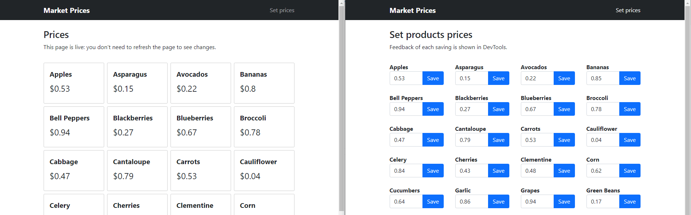

# Market Prices
Real-time application based on .NET, Azure SignalR, Azure Cosmos DB, and Angular. From the main page, you can monitor market products' prices. From the *Set prices* page, you can update products' prices. Changes are automatically pushed to the main page without reloading.

## Getting started
Follow the below steps to configure and run the application. Each step could depend on the previous one.

### Create Azure Resources
- Create a Resource Group in Azure.
- [Deploy the ARM template](https://docs.microsoft.com/en-us/azure/azure-resource-manager/templates/deploy-portal#deploy-resources-from-custom-template) `src/azure-services/template.json` into the resource group. You can customize the resources' names by specifying custom parameters.

### Database
- Import the `src/azure-services/cosmosdb-data.json` file into the Azure Cosmos DB container to fill it with example data. You can use the *Import* functionality of the Azure Portal.

### Back-end
*Folder*: `src/back-end`

- Compile and deploy the *MarketPrices.Functions* project to the Azure Function App.
- (Local debug only) Update the `local.settings.json` file by replacing the placeholder for the following settings with real values:
  - `CosmosDBConnection` => Connection string of the Cosmos DB Account.
  - `SignalRConnection` => Connection string of the SignalR Service.

**Note:** You don't need to configure any Azure service since the configuration is automatically performed when deploying the ARM template.

**Note:** The CORS *Allowed Origins* settings of the SignalR service is set to `*`, allowing use in your local machine. When you are done testing in your local machine, you should restrict access to the front-end application only.

### Front-end
*Folder*: `src/front-end`

- Configure Azure Storage Account to serve static Web Apps ([link](https://docs.microsoft.com/en-us/azure/storage/blobs/storage-blob-static-website#setting-up-a-static-website)).
- Set the `apiUrl` property of the `/src/environments/environment.prod.ts` file to the URL of the Azure Function App.
- Compile the front-end application by running `npm i && npm run build:prod` from the terminal opened in the project root folder.
- Deploy the front-end application by uploading the content of the `dist` folder to the Azure Storage `$web` container.

You can now navigate to the Storage Static Web App URL to use the application.